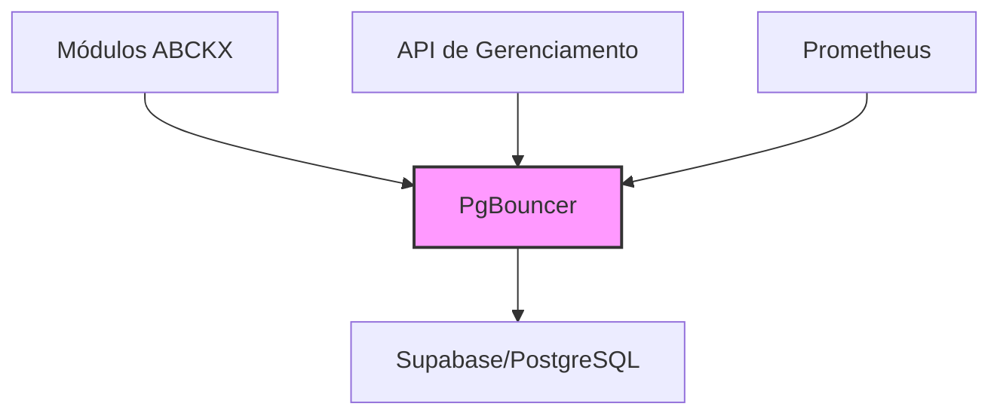

# PgBouncer - ABCKX Implementation

Implementação padronizada do PgBouncer para o ecossistema ABCKX, otimizada para uso com Supabase e sistemas modulares.

## 📋 Descrição

O PgBouncer é um middleware de pooling de conexões PostgreSQL leve e eficiente. Esta implementação foi customizada para:

- Integrar com o ecossistema de software modular ABCKX
- Gerenciar conexões a instâncias Supabase
- Permitir gerenciamento via API REST por sistemas automatizados/IA
- Fornecer monitoramento e métricas detalhadas

## 🚀 Funcionalidades

- **Pooling de Conexões Eficiente**: Reduz drasticamente o número de conexões ativas ao banco de dados
- **Múltiplos Pools**: Configuração para diferentes módulos do ecossistema
- **API de Gerenciamento**: Interface REST para controle e monitoramento
- **Integração com Prometheus**: Exportação de métricas detalhadas
- **Autenticação Segura**: Suporte para diversos métodos de autenticação
- **Interface de Admin**: Visualização e gerenciamento via web

## 🏗️ Arquitetura



## 🛠️ Instalação

### Via deploy-standalone

```bash
# Clone o repositório
git clone https://github.com/abckx-opensource/pgbouncer.git
cd pgbouncer

# Execute o script de instalação
./abckx/deploy/deploy.sh
```

### Via Docker direto

```bash
docker-compose -f docker/docker-compose.yml up -d
```

## ⚙️ Configuração

O PgBouncer é configurado através dos arquivos:

- `abckx/config/pgbouncer.ini`: Configuração principal
- `abckx/config/users.txt`: Arquivo de usuários e senhas

### Exemplo de configuração para Supabase

```ini
[databases]
* = host=seu-projeto.supabase.co port=5432 dbname=postgres

[pgbouncer]
listen_addr = 0.0.0.0
listen_port = 6432
auth_type = md5
auth_file = /etc/pgbouncer/users.txt
pool_mode = transaction
max_client_conn = 1000
default_pool_size = 20
```

## 🔌 API de Gerenciamento

A API REST está disponível em `http://hostname:8080/api` e oferece:

- **GET /status**: Informações gerais sobre o serviço
- **GET /pools**: Lista de pools configurados e estatísticas
- **GET /metrics**: Dados para Prometheus
- **POST /pools/{name}/pause**: Pausa um pool específico
- **POST /pools/{name}/resume**: Retoma um pool pausado
- **PUT /config**: Atualiza configurações

## 🔄 Atualização

Para atualizar o PgBouncer:

```bash
./abckx/deploy/update.sh
```

O processo de atualização:
1. Verifica a nova versão
2. Realiza backup das configurações atuais
3. Aplica a atualização
4. Executa testes de validação
5. Rollback automático em caso de falha

## 📊 Monitoramento

### Métricas Importantes

| Métrica | Descrição | Threshold |
|---------|-----------|-----------|
| `client_active_connections` | Conexões ativas de clientes | < 80% do max_client_conn |
| `server_active_connections` | Conexões ativas ao servidor | < 80% das conexões disponíveis |
| `client_waiting` | Clientes aguardando conexão | < 10 por pool |
| `avg_query_time` | Tempo médio de consulta | < 500ms |

### Integração com Prometheus

O exportador Prometheus está disponível em `http://hostname:9127/metrics`

## 🔍 Troubleshooting

### Problemas Comuns

| Problema | Possível Causa | Solução |
|----------|----------------|---------|
| Conexões recusadas | Limite máximo atingido | Aumentar `max_client_conn` |
| Lentidão | Pool muito pequeno | Aumentar `default_pool_size` |
| Erros de autenticação | Credenciais incorretas | Verificar `users.txt` |
| Alto uso de memória | Muitas conexões inativas | Reduzir `reserve_pool_size` |

### Logs

Os logs são gerados em `/var/log/pgbouncer` e podem ser consultados via:

```bash
tail -f /var/log/pgbouncer/pgbouncer.log
```

## 🔒 Segurança

- Todas as senhas são armazenadas com hash MD5
- Conexões podem ser configuradas com SSL/TLS
- Acesso administrativo é restrito por IP e credenciais
- Rotação automática de logs para evitar vazamento de informações

## 📚 Referências

- [Documentação Oficial PgBouncer](https://www.pgbouncer.org/usage.html)
- [Diretrizes ABCKX-Opensource](https://github.com/abckx-opensource/guidelines)
- [Práticas Recomendadas Supabase](https://supabase.com/docs/guides/database/connection-pooling)